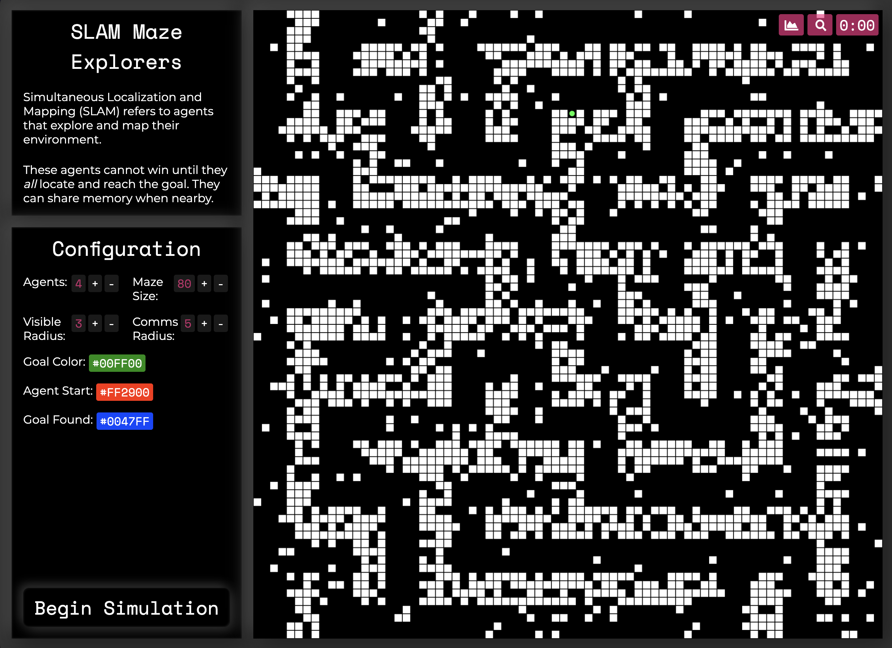

# SLAM Maze Explorers

Simultaneous Localization and Mapping (SLAM) refers to agents that explore and map their environment.

These agents cannot win until they _all_ locate and reach the goal. They can share memory when nearby.

### Usage

You can either run this project on its website (see the link at the top-right of the GitHub page), or locally.

It is built with Vite, so clone the project, run `npm i` and then `npm run dev` to test it locally.

#### Website

Use the configuration panel to make modifications to the project settings (colors currently aren't customizable).

You can use the menu buttons at the top right of the maze panel to switch to focus mode or graph mode (graph mode isn't implemented yet).

### Development

If you want to make any contributions to this project, either leave and issue or a PR. You can use the instructions in the usage section to get started.

### Why this project?

When I created this project, I was working on a couple libraries, [Algernon.js](https://github.com/We-Gold/algernon-js), a maze generation and solving library, and [TinyNEAT](https://github.com/We-Gold/tinyneat), a JS implementation of NEAT.

I wanted to make project that incorporated mazes, AI, and swarm cognition. This is what I came up with.

### Future Directions

This initial version only uses logic, A\*, and inter-agent communication to coordinate maze solving.

I would love to incorporate more complex AI (through better interfaces and a more customizable environment), or at least open the option for other programming projects to use this environment.

